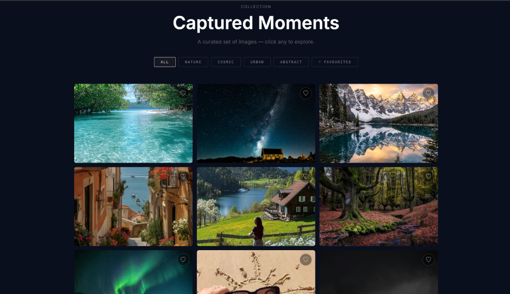
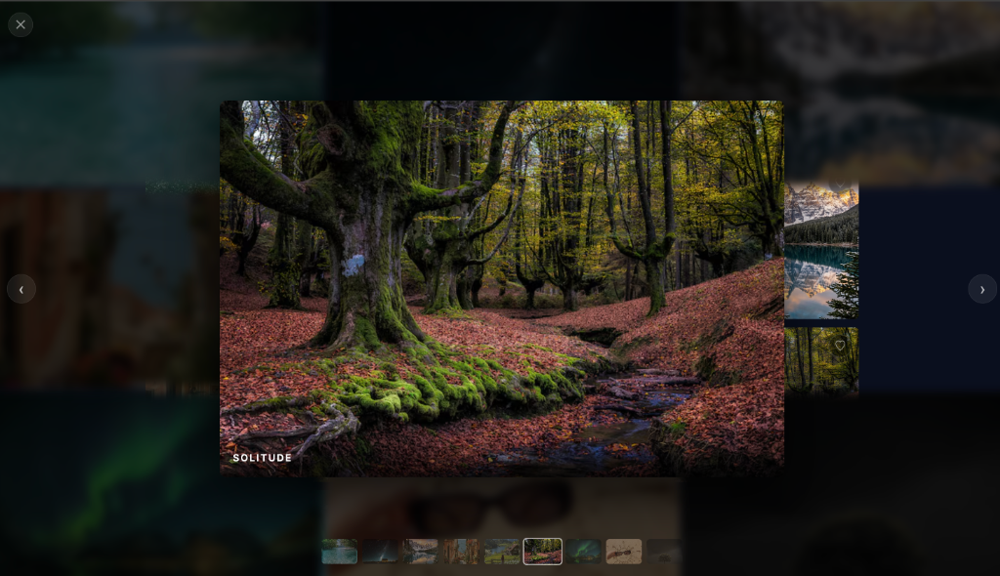
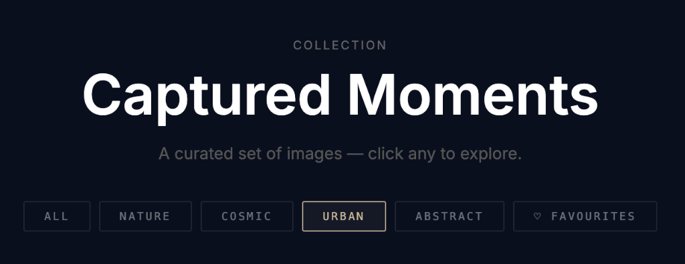
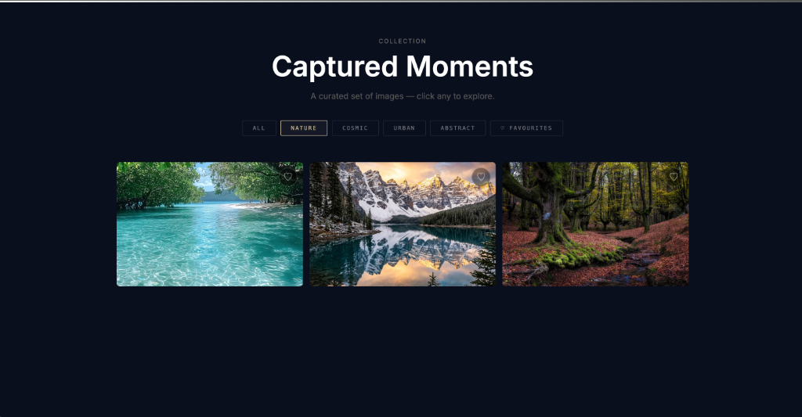
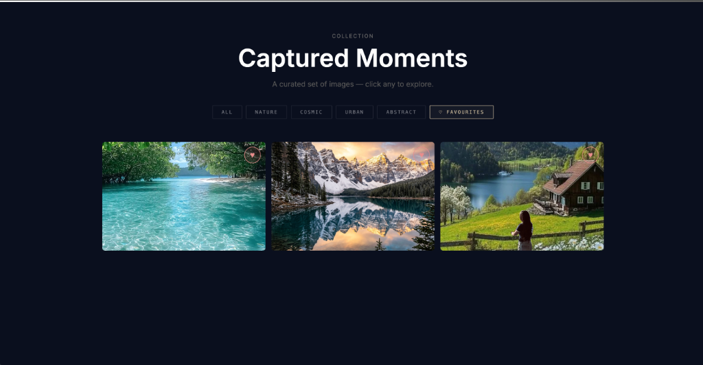

<div align="center">

# Captured *Moments* 📷

*A minimalist editorial image gallery — cinematic hover effects, immersive lightbox, category filtering, favourites, and full mobile support. Zero libraries.*

[](https://gallery-grid.netlify.app)


</div>

---

## ✦ Features

| | Feature | Description |
|---|---|---|
| ▦ | **Responsive Grid** | 3-col desktop · 2-col tablet · 1-col mobile, 3:2 aspect ratio |
| 🎬 | **Cinematic Hover** | Scale + blur + darken with bold text rising from center |
| ◉ | **Immersive Lightbox** | Fullscreen focus · blurred grid background · thumbnail strip |
| 🏷️ | **Category Filtering** | All · Nature · Cosmic · Urban · Abstract — instant DOM filtering |
| ♡ | **Favourites + localStorage** | Heart images · filter to favourites · persists on refresh |
| ⌨ | **Keyboard Navigation** | Arrow keys to navigate · Escape to close |
| 👆 | **Touch Swipe** | Native swipe gesture support for mobile lightbox |
| ◌ | **Skeleton Loader** | Shimmer animation while images load |

---

## 📸 Preview




<table>
  <tr>
    <td></td>
    <td></td>
  </tr>
</table>



---

## 📂 Project Structure

```
gallery_grid/
  ├── index.html     # layout, header, gallery items, lightbox markup
  ├── style.css      # grid, hover fx, lightbox, animations, media queries  
  ├── script.js      # lightbox logic, filtering, favourites, keyboard + swipe
  ├── images/        # 1.jpg → 9.jpg
  ├── README.md
  └── .gitignore
```

---

## 🌐 Live Deployment

You can view the live deployment of this project at: [https://gallery-grid.netlify.app](https://gallery-grid.netlify.app)

---

## ⚡ Language Breakdown

```
HTML  ████████████░░░░░░░░  48.9%
CSS   █████████░░░░░░░░░░░  36.3%
JS    ████░░░░░░░░░░░░░░░░  14.8%
```

---

<div align="center">

*Built by [Soumi Saha](https://soumi-saha.netlify.app)*  
[Portfolio](https://soumi-saha.netlify.app) &nbsp;·&nbsp; [GitHub](https://github.com/soumi-saha12) &nbsp;·&nbsp; [LinkedIn](https://linkedin.com/in/soumi-saha-523bba318)

</div>
